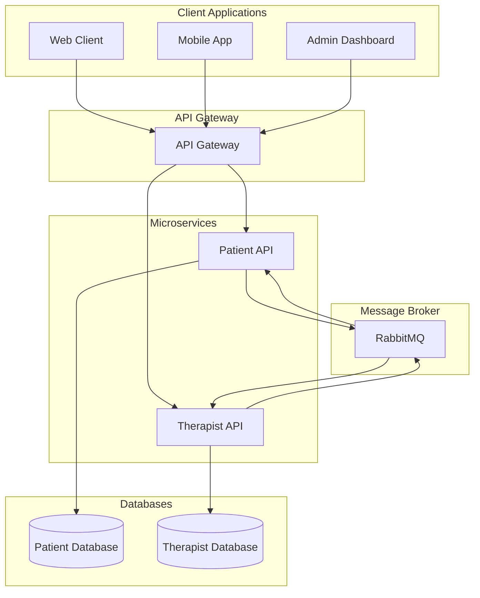
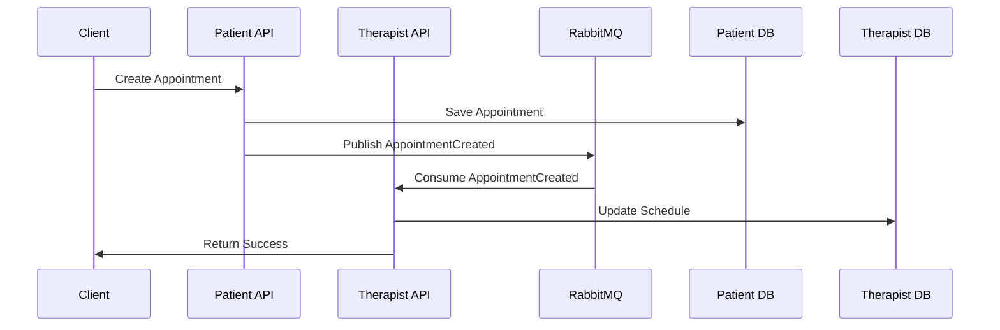
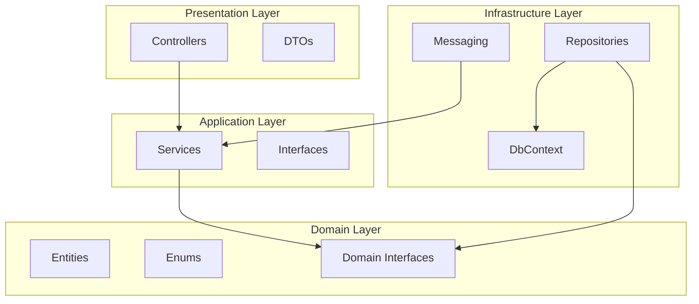
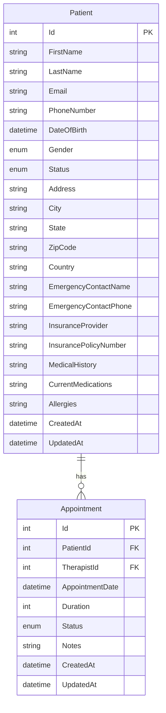
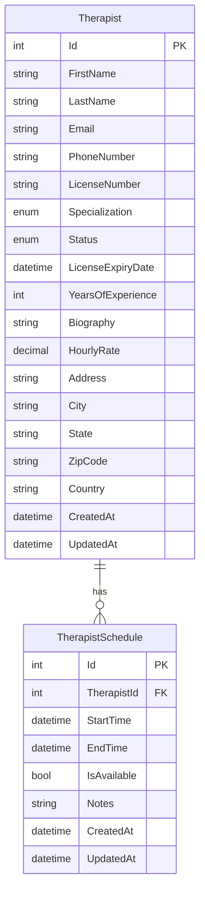
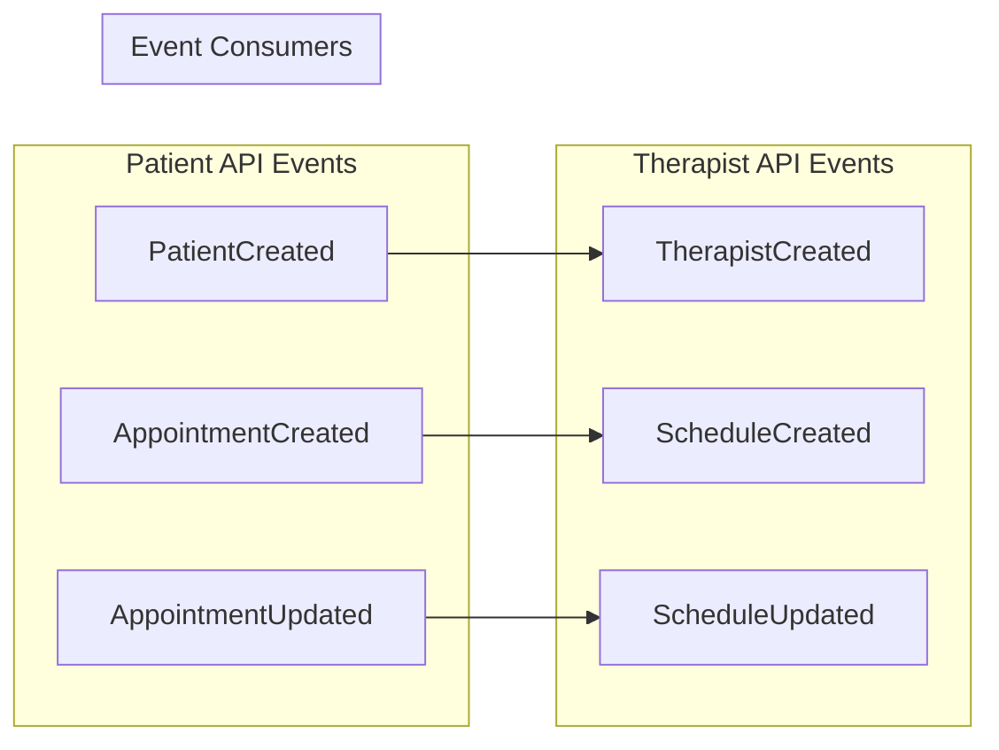
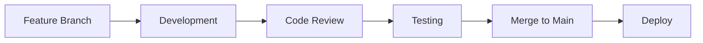

# 🏥 Therapist Platform

A modern, microservices-based platform for managing therapist-patient relationships, appointments, and scheduling. Built with .NET 8, Entity Framework Core, and RabbitMQ for event-driven communication.


## 📋 Table of Contents

- [Overview](#overview)
- [Architecture](#architecture)
- [Features](#features)
- [Technology Stack](#technology-stack)
- [Project Structure](#project-structure)
- [Getting Started](#getting-started)
- [API Documentation](#api-documentation)
- [Database Schema](#database-schema)
- [Event-Driven Communication](#event-driven-communication)
- [Development](#development)
- [Contributing](#contributing)
- [License](#license)

## 🎯 Overview

The Therapist Platform is a comprehensive solution designed to streamline the management of therapy services. It consists of two main microservices:

- **Patient API**: Manages patient information, appointments, and medical records
- **Therapist API**: Handles therapist profiles, schedules, and availability

The platform uses event-driven architecture with RabbitMQ for seamless communication between services, ensuring data consistency and real-time updates.

## 🏗️ Architecture

### System Architecture Diagram



### Service Communication Flow



## ✨ Features

### Patient Management
- 📝 Patient registration and profile management
- 🏥 Medical history tracking
- 💊 Medication and allergy management
- 📞 Emergency contact information
- 🏦 Insurance information handling

### Therapist Management
- 👨‍⚕️ Therapist profile and credentials
- 📅 Schedule and availability management
- 🎯 Specialization tracking
- 💰 Pricing and rate management
- 📋 License and certification tracking

### Appointment System
- 📅 Appointment scheduling and booking
- 🔄 Status tracking (Scheduled, Confirmed, Completed, Cancelled)
- ⏰ Time slot management
- 📧 Automated notifications
- 📊 Appointment analytics

### Event-Driven Features
- 🔄 Real-time data synchronization
- 📡 Cross-service communication
- 🚀 Scalable architecture
- 🔒 Data consistency guarantees

## 🛠️ Technology Stack

| Component | Technology | Version |
|-----------|------------|---------|
| **Backend Framework** | .NET 8 | 8.0 |
| **ORM** | Entity Framework Core | 8.0 |
| **Database** | SQL Server | 2022 |
| **Message Broker** | RabbitMQ | 4.1.3 |
| **API Documentation** | Swagger/OpenAPI | 3.0 |
| **Containerization** | Docker | Latest |
| **Architecture Pattern** | Clean Architecture | - |
| **Communication** | REST APIs | - |

## 📁 Project Structure

```
therapist/
├── 📦 docker-compose.yml
├── 📋 TherapistPlatform.sln
└── 📂 src/
    ├── 🏥 PatientApi/
    │   ├── 📱 PatientApi.Presentation/     # API Controllers & Configuration
    │   ├── 🧠 PatientApi.Application/      # Business Logic & Services
    │   ├── 🏗️ PatientApi.Domain/          # Entities & Interfaces
    │   └── 🗄️ PatientApi.Infrastructure/  # Data Access & External Services
    ├── 👨‍⚕️ TherapistApi/
    │   ├── 📱 TherapistApi.Presentation/   # API Controllers & Configuration
    │   ├── 🧠 TherapistApi.Application/    # Business Logic & Services
    │   ├── 🏗️ TherapistApi.Domain/        # Entities & Interfaces
    │   └── 🗄️ TherapistApi.Infrastructure/ # Data Access & External Services
    └── 🔗 Shared/
        ├── 📦 Shared.Common/               # Common Models & Interfaces
        └── 📡 Shared.Events/               # Event Definitions
```

### Clean Architecture Layers



## 🚀 Getting Started

### Prerequisites

- [.NET 8 SDK](https://dotnet.microsoft.com/download/dotnet/8.0)
- [Docker Desktop](https://www.docker.com/products/docker-desktop)
- [SQL Server](https://www.microsoft.com/en-us/sql-server/sql-server-downloads) (or use Docker)
- [Visual Studio 2022](https://visualstudio.microsoft.com/) or [VS Code](https://code.visualstudio.com/)

### Quick Start

1. **Clone the repository**
   ```bash
   git clone https://github.com/yourusername/therapist-platform.git
   cd therapist-platform
   ```

2. **Start RabbitMQ using Docker**
   ```bash
   docker-compose up -d
   ```

3. **Configure connection strings**
   
   Update the connection strings in both API projects:
   
   ```json
   // PatientApi/appsettings.json
   {
     "ConnectionStrings": {
       "DefaultConnection": "Server=localhost;Database=PatientDb;Trusted_Connection=true;TrustServerCertificate=true;"
     }
   }
   ```

4. **Run database migrations**
   ```bash
   # Patient API
   cd src/PatientApi/PatientApi.Infrastructure
   dotnet ef database update
   
   # Therapist API
   cd ../../TherapistApi/TherapistApi.Infrastructure
   dotnet ef database update
   ```

5. **Run the applications**
   ```bash
   # Patient API
   cd ../../PatientApi/PatientApi.Presentation
   dotnet run
   
   # Therapist API (in a new terminal)
   cd ../../TherapistApi/TherapistApi.Presentation
   dotnet run
   ```

6. **Access the APIs**
   - Patient API: https://localhost:7001/swagger
   - Therapist API: https://localhost:7002/swagger
   - RabbitMQ Management: http://localhost:15672 (guest/guest)

## 📚 API Documentation

### Patient API Endpoints

| Method | Endpoint | Description |
|--------|----------|-------------|
| `GET` | `/api/patients` | Get all patients |
| `GET` | `/api/patients/{id}` | Get patient by ID |
| `POST` | `/api/patients` | Create new patient |
| `PUT` | `/api/patients/{id}` | Update patient |
| `DELETE` | `/api/patients/{id}` | Delete patient |
| `GET` | `/api/appointments` | Get all appointments |
| `POST` | `/api/appointments` | Create appointment |
| `PUT` | `/api/appointments/{id}` | Update appointment |

### Therapist API Endpoints

| Method | Endpoint | Description |
|--------|----------|-------------|
| `GET` | `/api/therapists` | Get all therapists |
| `GET` | `/api/therapists/{id}` | Get therapist by ID |
| `POST` | `/api/therapists` | Create new therapist |
| `PUT` | `/api/therapists/{id}` | Update therapist |
| `GET` | `/api/schedule` | Get therapist schedules |
| `POST` | `/api/schedule` | Create schedule entry |

## 🗄️ Database Schema

### Patient Database Schema



### Therapist Database Schema



## 📡 Event-Driven Communication

The platform uses RabbitMQ for event-driven communication between services. Here are the main events:

### Event Flow Diagram



### Event Types

| Event | Publisher | Consumers | Description |
|-------|-----------|-----------|-------------|
| `PatientCreated` | Patient API | Therapist API | New patient registration |
| `AppointmentCreated` | Patient API | Therapist API | New appointment booking |
| `AppointmentUpdated` | Patient API | Therapist API | Appointment modification |
| `TherapistCreated` | Therapist API | Patient API | New therapist registration |
| `ScheduleCreated` | Therapist API | Patient API | New schedule entry |
| `ScheduleUpdated` | Therapist API | Patient API | Schedule modification |

## 🛠️ Development

### Development Workflow



### Running Tests

```bash
# Run all tests
dotnet test

# Run specific project tests
dotnet test src/PatientApi/PatientApi.Tests/
dotnet test src/TherapistApi/TherapistApi.Tests/
```

### Code Quality

The project follows clean architecture principles and best practices:

- ✅ **SOLID Principles**
- ✅ **Dependency Injection**
- ✅ **Repository Pattern**
- ✅ **CQRS Pattern**
- ✅ **Event-Driven Architecture**
- ✅ **API Versioning**
- ✅ **Error Handling**
- ✅ **Logging**

### Environment Configuration

```json
{
  "Logging": {
    "LogLevel": {
      "Default": "Information",
      "Microsoft.AspNetCore": "Warning"
    }
  },
  "AllowedHosts": "*",
  "ConnectionStrings": {
    "DefaultConnection": "Server=localhost;Database=TherapistDb;Trusted_Connection=true;TrustServerCertificate=true;"
  },
  "RabbitMQ": {
    "Host": "localhost",
    "Username": "guest",
    "Password": "guest"
  }
}
```

## 🤝 Contributing

We welcome contributions! Please follow these steps:

1. **Fork the repository**
2. **Create a feature branch** (`git checkout -b feature/amazing-feature`)
3. **Commit your changes** (`git commit -m 'Add amazing feature'`)
4. **Push to the branch** (`git push origin feature/amazing-feature`)
5. **Open a Pull Request**

### Contribution Guidelines

- 📝 Follow the existing code style
- 🧪 Add tests for new features
- 📚 Update documentation
- 🔍 Ensure all tests pass
- 📋 Use conventional commit messages

## 📄 License

This project is licensed under the MIT License - see the [LICENSE](LICENSE) file for details.

## 📞 Support

For support and questions:

- 📧 Email: support@therapistplatform.com
- 🐛 Issues: [GitHub Issues](https://github.com/yourusername/therapist-platform/issues)
- 📖 Documentation: [Wiki](https://github.com/yourusername/therapist-platform/wiki)

---

<div align="center">

**Made with ❤️ for better healthcare management**

[](https://github.com/yourusername/therapist-platform/stargazers)
[](https://github.com/yourusername/therapist-platform/network)
[](https://github.com/yourusername/therapist-platform/issues)

</div>
